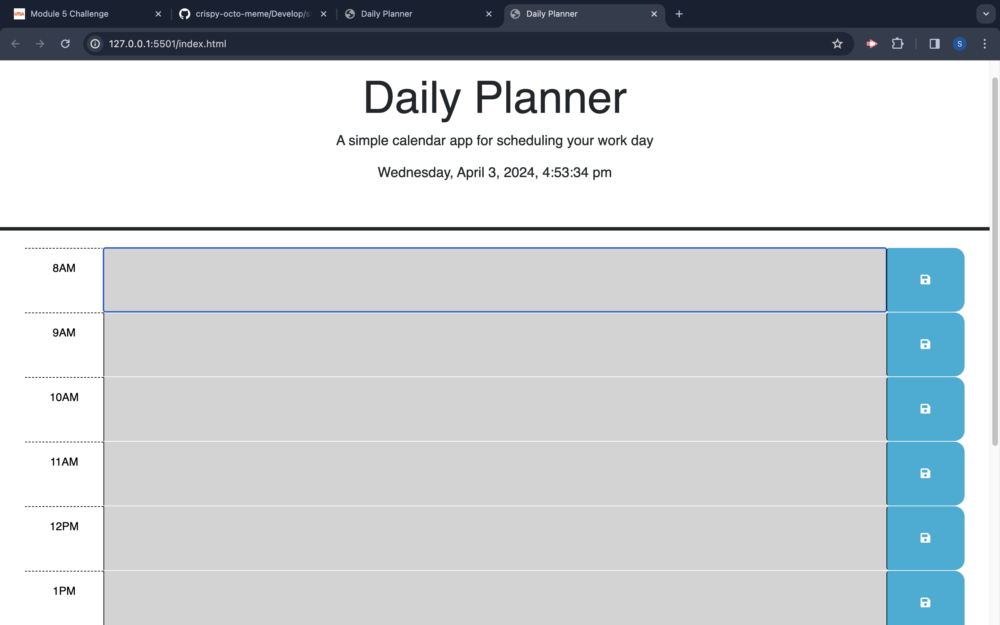
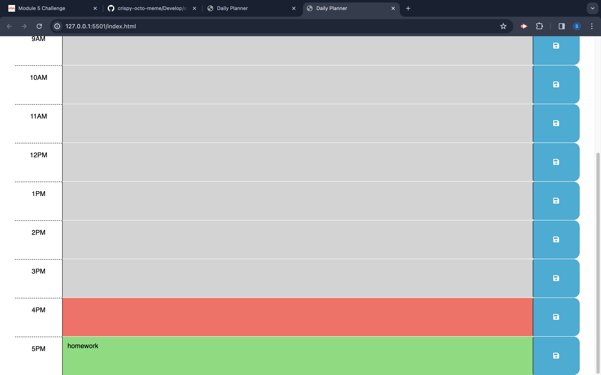

# daily-planner
Work Day Scheduler Starter Code
# Work Day Scheduler Starter Code
# Daily Planner 
### I created a user-friendly website for daily planning, enabling users to organize their schedules hour by hour. By incorporating technologies like jQuery and Day.js, along with local storage functionality, users can easily input and save their plans. The website's intuitive interface simplifies the task management process, helping users stay productive and organized throughout the day.

### Features 
- The current date and time 
- Color coded time-blocks for past, present, and future events
- Ability to save user input to the user's local storage

## 
## 

## [Deployed Application (click here)](https://sambishop06.github.io/daily-planner/) 

## Installation: 
- [Visual Studio Code](https://code.visualstudio.com/download)
